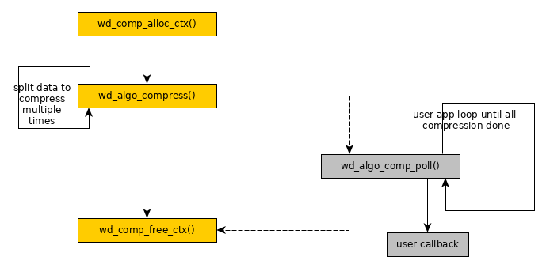

# WarpDrive Architecture Design


| Version | Author | Changes |
| --- | :---- | :---- |
|  0.91   | Haojian Zhuang |1) Remove the content of 3rd party memory  |
|         | Zhou Wang      |   allocation. |
|         |                |2) Remove "ss_va" and "ss_dma" from struct wd_chan.|
|         |                |3) Change to user app polling async interface.  |
|         |                |4) Add examples.  |
|  0.92   |                |1) Reorganize the document. |
|         |                |2) Remove some structures that are unused in apps. |
|  0.93   |                |1) Avoid to discuss whether IOMMU disabled in NOSVA |
|         |                |   scenario since it's not important. |
|         |                |2) Remove multiple queue since it's transparent to |
|         |                |   user application. |
|  0.94   |                |1) Split WarpDrive into UACCE, libwd, algorithm |
|         |                |   libraries and libaffinity. Change doc according |
|         |                |   to this notion. |
|         |                |2) Illustrate how to select hardware accelerator. |
|         |                |3) Illustrate how libaffinity working. |
|  0.95   |                |1) Remove libaffinity extension for unclear logic. |
|         |                |2) Add API to identify NOSVA in libwd. |
|  0.96   |                |1) Fix on asynchronous operation. |
|  0.97   |                |1) Fix the missing hook of async poll. |
|         |                |2) Illustrate more on binding driver. |
|  0.98   |                |1) Do not expose context to user application. Use |
|         |                |   handler instead. |
|         |                |2) Illustrate each parameter or field in table. |
|         |                |3) Adjust the layout. |
|  0.99   |                |1) Fix the parameters in wd_alg_compress() and |
|         |                |   wd_alg_decompress(). |
|  0.100  |                |1) Remove wd_get_domain_affinity() for no benefit. |
|         |                |2) Remove dev_list from struct wd_alg_comp_ctx |
|         |                |   since only one device is meaningful. |
|         |                |3) Rename context to session. Rename channel to |
|         |                |   context. |
|         |                |4) Remove tag_id for not used. |
|         |                |5) Fix in struct wd_comp_arg. |
|         |                |6) Add compression interface for stream mode. |
|         |                |7) Simplify the parameters in wd_drv_unmap_qfr(). |
|         |                |8) Append a new image for asynchronous mode. |


## Terminology

| Term | Illustration |
| :-- | :-- |
| SVA             | Shared Virtual Addressing |
| NUMA            | Non Uniform Memory Access |
| Context         | A dual directional hardware communication resource between |
|                 | CPU and hardware accelerator. |
| Context Manager | A device manages many contexts. |


## Overview

WarpDrive is a framework for user application to access hardware accelerator 
in a unified, secure, and efficient way. WarpDrive is comprised of UACCE, libwd 
and many other algorithm libraries for different applications.


Libwd provides a wrapper of basic UACCE user space interfaces, they will be a 
set of helper functions. Libwd offers a register interface to let hardware 
vendors to register their own user space driver, which could use above helper 
functions to do UACCE related work.

Algorithm libraries offer a set of APIs to users, who could use this set of 
APIs to do specific task without accessing low level implementations.

This document focuses on the design of libwd and algorithm libraries.


## Based Technology

WarpDrive relies on SVA (Shared Virtual Address) that needs to be supported 
by IOMMU. And two scenarioes are supported, SVA scenario and NOSVA scenario.

In SVA scenario, virtual address could be used by vendor driver directly. In 
NOSVA scenario, only the address that could be recognized by driver is used 
in vendor driver. So memory copy is required in NOSVA scenario. And it'll 
bring up the potential security issue since vendor driver is in user space. 
NOSVA scenario will be removed in the future.

In SVA scenario, memory address is always virtual address whatever it's in 
user application or vendor driver. So sharing memory address is easily without 
any memory copy. In NOSVA scenario, memory address is virtual address only 
in user application. So libwd provides an interface to allocate memory in 
vendor driver. Then it implied memory copy between vendor driver and user 
application. Performance will be hurted in this case.

According to the limitations on NOSVA scenario, it'll be removed in the future. 
WarpDrive is designed for SVA scenario.


### UACCE user space API

As the kernel driver of WarpDrive, UACCE offers a set of APIs between kernel 
and user space.

Since UACCE driver is still under upstreaming process, latest APIs of UACCE 
can be found in <https://lkml.org/lkml/2019/11/22/1728>. UACCE is introduced 
in "uacce.rst" and "sysfs-driver-uacce" of this patchset.

Hardware accelerator registers in UACCE as a char dev. At the same time, 
hardware informations of accelerators are also exported in sysfs node. For 
example, the file path of char dev is */dev/misc/[Accel]* and hardware 
informations are in */sys/class/uacce/[Accel]/*. The same name is shared in 
both devfs and sysfs. The *Accel* is comprised of name, dash and id.

After opening this char device once, vendor driver will get a context to access 
the resource of this accelerator device. Vendor driver can configure above 
context by ioctl of this opened fd, and mmap hardware resource, like MMIO or 
context to user space.

## Libaffinity

### Libaffinity APIs

Libaffinity is used to set the range of hardware accelerators. Then algorithm 
library could choose a high priority device from the set. Libaffinity isn't 
the requisite component in Warpdrive framework. It's only used when user 
application knows the hardware in detail and wants to choose a few specific 
accelerators to gain better performance.

When each hardware accelerator registers in UACCE subsystem, it gets an ID that 
is attached in the device name. User could get it from sysfs node.

```
    typedef wd_dev_mask_t   unsigned long long int;
    wd_dev_mask_t           dev_mask;
```

The ID is counted from 0. The type of 64-bit unsigned value, *wd_dev_mask_t*, 
is defined to collect all hardware accelerators in the system. Each bit 
is relative to one hardware accelerator. Bit 0 means the hardware accelerator 
with ID 0. It also means that libaffinity only support 64 accelerators at most.

***int wd_get_affinity(char \*alg_name, wd_dev_mask_t \*dev_mask);***

| Layer | Parameter | Direction | Comments |
| :-- | :-- | :-- | :-- |
| affinity | *alg_name* | Input  | Indicate the name of algorithm. |
|          | *dev_mask* | Output | Indicate the mask bits of all valid UACCE |
|          |            |        | devices. |

*wd_get_affinity()* returns the set of matched accelerators that support 
specified algorithm with *alg_name*. The set is contained in *dev_mask*. The 
return value is 0 if it succeeds to find the set of accelerators. The return 
value is negative value if it fails to find the set.

***int wd_get_numa_affinity(int id, wd_dev_mask_t \*dev_mask);***

| Layer | Parameter | Direction | Comments |
| :-- | :-- | :-- | :-- |
| affinity | *id*       | Input  | Indicate the ID of accelerator in UACCE |
|          |            |        | subsystem. |
|          | *dev_mask* | Output | Indicate the mask bits of valid UACCE |
|          |            |        | devices in the same NUMA node range. |

*wd_get_numa_affinity()* is different from *wd_get_affinity()*. It only wants 
to find the accelerators in the range of the same NUMA node.

In the same NUMA node, memory should be in the equal distance from different 
devices. User application should gain better performance on it if data needs 
to be shared among different accelerators.

*wd_get_numa_affinity()* returns the set of matched accelerators that are in 
the range of the same NUMA node. The set is stored in *dev_mask*. The return 
value is 0 if the set is found. The return value is negative value if it fails 
to find the set.

*wd_get_affinity()* and *wd_get_numa_affinity()* both query the set of matched 
accelerators. User application needs to limit algorithm library to chose an 
accelerator in this set. All are based on the *dev_mask* value. Libaffinity 
doesn't need to call any API in algorithm library. User application gets the 
*dev_mask* value already, then it just needs to notify algorithm library to 
chose an accelerator in the limited range.

The model of usage case is in below.

User already knows which specified accelerators could bring better performance. 
It just query these accelerators by *wd_get_affinity()* or the combination in 
*wd_get_affinity()* and *wd_get_numa_affinity()*. The set is stored in 
*dev_mask*.

Then user application requests algorithm library with *dev_mask* to choose a 
right accelerator effiently.


## Algorithm Libraries

WarpDrive is a framework that supports multiple algorithm interfaces. We'll 
discuss compression algorithm interface in below. And crypto algorithm 
interface will be added later.


### Register Vendor Driver

A vendor driver is the counterpart of a hardware accelerator. A vendor driver 
is an implementation of an algorithm. Because of these, algorithm library 
binds an accelerator and a vendor driver together. There're different driver 
models in algorithm library for different accelerators.

An example of binding compression device and compression driver is in below.

```
    struct wd_alg_comp {
        char *drv_name;
        char *alg_name;
        int  (*init)(struct alg_comp_sess *sess, ...);
        void (*exit)(struct alg_comp_sess *sess, ...);
        ...
    };
```

The fields of *struct wd_alg_comp* are mentioned in Section Compression 
Algorithm.

Each vendor driver implements an instance of its driver model. The key field 
is *drv_name*. *drv_name* field must match *Accel name* in devfs or sysfs 
without dash and ID.

All the instances in vendor drivers must be exposed to libwd. So libwd 
maintained several lists for different driver models, such as 
*wd_comp_drv_list*, *wd_crypto_drv_list*, etc. Categorizing drivers into 
different lists is just for better performance on seeking driver.

```
    static struct wd_alg_comp wd_comp_drv_list[] = {
        &Accel_A,
        &Accel_B,
        ...
    };
```

*wd_comp_drv_list* is maintained in algorithm library.


### Bind Device to Vendor Driver

When user requests to use accelerator, it just sends the request to algorithm 
library. Algorithm library parses the request to choose a right accelerator 
by algorithm name and affinity value. All matched devices are listed in a 
dynamic list in below.

```
    struct wd_dev_list {
        char                dev_name[MAX_DEV_NAME_LEN];
        char                node_path[];
        char                alg_name[];
        int                 avail_ctxs;
        int                 id;     // ID in UACCE subsystem
        int                 mask;
        struct wd_dev_list  *list;
    };
```

| Field | Comments |
| :-- | :-- |
| *dev_name*    | Indicate the name of accelerator without UACCE ID. |
| *node_path*   | Indicate the file path of the accelerator in devfs. |
| *alg_name*    | Indicate which algorithm is supported by the accelerator. |
| *avail_ctxs*  | Indicate how many contexts are available to the accelerator. |
| *id*          | Indicate the ID in UACCE subsystem. ID is also a bit index. |
| *mask*        | Indicate the bit value that is converted from ID. |
| *list*        | Indicate to the next matched accelerator. If there's no more |
|               | accelerators, it's just NULL. |

This device list is a list with a priority on *avail_ctxs*. *avail_ctxs* 
indicates the the number of context resources. If there're more contexts 
available to an accelerator, it is in a high priority to be choosen. It's 
based on the policy of resource balance.

*avail_ctxs* is also introduced in Section Launch Vendor Driver.

***static struct wd_dev_list \*query_dev_list(char \*alg_name)***

| Layer | Parameter | Direction | Comments |
| :-- | :-- | :-- | :-- |
| alg | *alg_name* | Input | Indicate the algorithm name. |

Return the device list if it succeds. Return NULL if it fails.

So *query_dev_list()* is an internal function of algorithm library that returns 
the matched device list.

When both device and driver are founded by algorithm library, it needs to be 
stored in somewhere. In algorithm library, these could be stored in *session* 
that will be introduced in Section Session.


### Session

Session is a space that collect accelerator and driver. With session, algorithm 
library could track a task.

Session is a internal structure that only be accessed by algorithm library and 
vendor driver. User application needs the session to track the task, but it 
can't access the informations in session directly. Algorithm library converts 
the session to a handler and exposes handler to user application.

```
    struct alg_comp_sess {
        char                *alg_name;    /* zlib or gzip */
        char                node_path[];
        int                 id;
        wd_dev_mask_t       affinity;
        struct wd_alg_comp  *drv;
        void                *priv;       /* vendor specific structure */
    };
```

The fields in *struct alg_comp_sess* are illustrated in Section Compression 
Algorithm.


### Launch Vendor Driver

With session, accelerator and driver are stored in *node_path* and *drv* 
fields. Although driver is found, algorithm library still occupies the CPU. 
Algorithm library calls *drv->init()* to transfer the control of CPU to vendor 
driver.

In vendor driver, a hardware resource, context, is important to request.

Context is the common hardware resource of each hardware accelerator. contexts 
are managed by context manager. When there're multiple context managers in the 
system, different hardware accelerators may bind to different context managers. 
*avail_ctxs* could denote how much contexts could be accessed by the 
accelerator. When multiple accelerators share the same context manager, 
*avail_ctxs* is same to these accelerators. The value of *avail_ctxs* could 
bet gotten from sysfs node.

Since context is a common resource, libwd encapuslates the interface to request 
it. It's introduced in Section Libwd Helper Functions.


### Compression Algorithm

Compression algorithm is between user application and vendor driver.

```
    typedef handle_t    unsigned long long int;
```
***int wd_alg_comp_alloc_sess(char \*alg_name, wd_dev_mask_t affinity, 
handler_t \*handler)***

| Layer | Parameter | Direction | Comments |
| :-- | :-- | :-- | :-- |
| algorithm | *alg_name* | input  | Set the name of algorithm type, such as |
|           |            |        | "zlib", "gzip", etc. |
|           | *affinity* | input  | Set the mask value of UACCE devices. |
|           | *handler*  | output | A 64-bit handler value. |

*wd_alg_comp_alloc_sess()* is used to allocate a session that is denoted by 
a handle. Return 0 if succeeds. Return error number if fails.

***void wd_alg_comp_free_sess(handle_t handle)***

| Layer | Parameter | Direction | Comments |
| :-- | :-- | :-- | :-- |
| algorithm | *handler* | input | A 64-bit handler value. |

*wd_alg_comp_free_sess()* is used to release a session that is denoted by a 
handle.

Both *wd_alg_comp_alloc_sess()* and *wd_alg_comp_free_sess()* are used by user 
applications.


```
    struct wd_alg_comp {
        char *drv_name;
        char *algo_name;
        int  (*init)(struct wd_alg_comp_sess *sess, ...);
        void (*exit)(struct wd_alg_comp_sess *sess, ...);
        int  (*deflate)(struct wd_alg_comp_sess *sess, ...);
        int  (*inflate)(struct wd_alg_comp_sess *sess, ...);
        int  (*async_poll)(struct wd_alg_comp_sess *sess, ...);
    };
```

| Field | Comments |
| :-- | :-- |
| *alg_name*   | Algorithm name |
| *drv_name*   | Driver name that is matched with device name. |
| *init*       | Hook to do hardware initialization that implemented in vendor |
|              | driver. |
| *exit*       | Hook to finish hardware operation that implemented in vendor |
|              | driver. |
| *deflate*    | Hook to deflate by hardware that implemented in vendor |
|              | driver. |
| *inflate*    | Hook to inflate by hardware that implemented in vendor |
|              | driver. |
| *async_poll* | Hook to poll hardware status in asynchronous operation that |
|              | implemented in vendor driver. |

Each vendor driver needs to implement an instance of *struct wd_alg_comp*. It 
should be referenced in a driver list of algorithm library.


```
    struct wd_alg_comp_sess {
        char                *alg_name;    /* zlib or gzip */
        char                node_path[];
        int                 id;
        wd_dev_mask_t       affinity;
        struct wd_alg_comp  *drv;
        void                *priv;       /* vendor specific structure */
    };
```

| Field | Comments |
| :-- | :-- |
| *alg_name*  | Algorithm name. |
| *node_path* | The node path of chosen hardware accelerator. |
| *id*        | Indicate the ID of accelerator in UACCE subsystem. |
| *affinity*  | Mask of preferred devices. |
| *drv*       | Hook to vendor driver implementation. |

User application calls *wd_alg_comp_alloc_sess()* to create a session. In the 
meantime, a device is chosen and a driver is matched. But of them are stored in 
the session.

Then algorithm library can call the *drv->init()*. In this function, vendor 
driver needs to request a context by *wd_request_ctx()*.

When user application requests for a session, it could apply hardware 
accelerator to work in synchronous mode or in asychronous mode. For synchronous 
mode, parameter *cb* should be NULL. For asynchronous mode, parameter *cb* must 
be provided.

```
    struct priv_vendor_sess {
        void            *buf_in;
        void            *buf_out;
        size_t          in_len;
        size_t          out_len;
        __u64           phys_in;
        __u64           phys_out;
        struct wd_ctx  *ctx;
        ...
    };
```

| Field | Comments |
| :-- | :-- |
| *buf_in*   | Indicate virtual address of temporary IN buffer. |
| *buf_out*  | Indicate virtual address of temporary OUT buffer. |
| *in_len*   | Indicate the length of IN buffer. |
| *out_len*  | Indicate the length of OUT buffer. |
| *phys_in*  | Indicate physical address of temporary IN buffer. |
| *phys_out* | Indicate physical address of temporary OUT buffer. |

*struct priv_vendor_sess* is an example of private structure attached in *priv* 
field of *struct wd_comp_sess*. Vendor driver could define the structure by 
itself. And it's also bound in *init()* implementation in vendor driver.


#### Compression & Decompression

```
    typedef void *wd_alg_comp_cb_t(void);
    struct wd_comp_arg {
        void              *src;
        size_t            *src_len;
        void              *dst;
        size_t            *dst_len;
        wd_alg_comp_cb_t  *cb;
    };
```

| Field | Comments |
| :-- | :-- |
| *src*     | Indicate the virtual address of source buffer that is prepared |
|           | by user application. |
| *src_len* | Indicate the length of source buffer. |
| *dst*     | Indicate the virtual address of destination buffer that is |
|           | prepared by user application. |
| *dst_len* | Indicate the length of destination buffer. |
| *cb*      | Indicate the user application callback that is used in |
|           | asynchronous mode. |

*cb* is the callback function of user application. And it's optional. When it's 
synchronous operation, it should be always NULL.

*struct wd_comp_arg* stores the information about source and destination 
buffers. This structure is the input parameter of compression and decompression.

If user application wants to do the compression or decompression, it needs to 
functions in below.

***int wd_alg_compress(handler_t handler, struct wd_comp_arg \*arg)***

| Layer | Parameter | Direction | Comments |
| :-- | :-- | :-- | :-- |
| algorithm | *handler*  | Input | Indicate the session. User application |
|           |            |       | doesn't know the details in session. |
|           | *arg*      | Input | Indicate the source and destination buffer. |

Return 0 if it succeeds. Return negative value if it fails.

***int wd_alg_decompress(handler_t handler, struct wd_comp_arg \*arg)***

| Layer | Parameter | Direction | Comments |
| :-- | :-- | :-- | :-- |
| algorithm | *handler*  | Input | Indicate the session. User application |
|           |            |       | doesn't know the details in session. |
|           | *arg*      | Input | Indicate the source and destination buffer. |

Return 0 if it succeeds. Return negative value if it fails.

***int wd_alg_strm_compress(handler_t handler, struct wd_comp_arg \*arg)***

| Layer | Parameter | Direction | Comments |
| :-- | :-- | :-- | :-- |
| algorithm | *handler* | Input | Indicate the session. User application |
|           |           |       | doesn't know the details in session. |
|           | *arg*     | Input | Indicate the source and destionation buffer. |

Return 0 if it succeeds. Return negative value if it fails.


***int wd_alg_strm_decompress(handler_t handler, struct wd_comp_arg \*arg)***

| Layer | Parameter | Direction | Comments |
| :-- | :-- | :-- | :-- |
| algorithm | *handler* | Input | Indicate the session. User application |
|           |           |       | doesn't know the details in session. |
|           | *arg*     | Input | Indicate the source and destionation buffer. |

Return 0 if it succeeds. Return negative value if it fails.

*wd_alg_strm_compress()* and *wd_alg_strm_decompress()* are different from 
*wd_alg_compress()* and *wd_alg_decompress()*, although they're also used in 
compression and decompression.

*wd_alg_strm_compress()* and *wd_alg_strm_decompress()* are used in stream 
mode. It means there's dependency between data blocks. When do the compression, 
user must wait to compress the next data block if the previous one isn't 
finished in hardware compression.


### Asynchronous Mode

When it's in synchronous mode, user application is blocked in 
*wd_alg_compress()* or *wd_alg_decompress()* until hardware operation is 
done. When it's in asynchronous mode, user application gets return from 
*wd_alg_compress()* or *wd_alg_decompress()* immediately. But hardware 
accelerator is still running. User application could call *wd_alg_comp_poll()* 
to check whether hardware is done.

If multiple jobs are running in hardware in parallel, *wd_alg_comp_poll()* 
could save the time on polling hardware status. And user application could 
sleep for a fixed time slot before polling status, it could save CPU resources.

***int wd_alg_comp_poll(handler_t handler)***

| Parameter | Direction | Comments |
| :-- | :-- | :-- |
| *handler* | Input | Indicate the session. User application doesn't know the |
|           |       | details in session. |

Return 0 if hardware is done. Return error number if hardware is still working.

Finally, *wd_alg_comp_poll()* calls *async_poll()* in vendor driver to poll 
the hardware.

Because *wd_alg_comp_poll()* is a polling function. Suggest user application 
invokes the polling for multiple times. Otherwise, it may miss the event of
hardware accelerator completion.

Vendor driver could merge and copy all these pieces into output buffer that 
provided by application.


## Libwd Helper Functions

Hardware accelerator communicates with CPU by MMIO and contexts. Libwd helper 
functions provide the interface that vendor driver could access memory from 
WarpDrive.


### Context

Context is a dual directional hardware communication resource between hardware 
accelerator and CPU. When vendor driver wants to access resources of a
accelerator, a context is the requisite resource.

```
    struct wd_ctx {
        int  fd;
        char node_path[];
        void *sess;    // point to session in algorithm library
        void *priv;   // point to vendor specific structure
    };
```

| Field | Comments |
| :-- | :-- |
| *fd*        | Indicate the file descriptor of hardware accelerator. |
| *node_path* | Indicate the file path of hardware accelerator. |
| *sess*       | Indicate the session that is created in algorithm library. |
| *priv*      | Indicate the vendor specific structure. |

Context is a hardware resource. UACCE creates a char dev for each registered 
hardware device. Once the char dev is opened by vendor driver, a context is 
allocated by UACCE. *fd* (file descriptor) represents the context that could 
be accessed by vendor driver. In libwd, context is defined as *struct wd_ctx*.

Vendor driver must know which hardware accelerator should be accessed. From 
the view of vendor driver, the device is represented by device node path. 
The device node path has already been saved in the session. So vendor driver 
just fetches it from session, and requests a context by the device node path.

Libwd defines APIs to allocate contexts.

***struct wd_ctx \*wd_request_ctx(char *node_path);***

| Layer | Parameter | Direction | Comments |
| :-- | :-- | :-- | :-- |
| libwd | *node_path* | Input | Indicate the file path of hardware |
|       |             |       | accelerator. |

Return the handler of context if it succeeds. Return NULL if it fails.

***void wd_release_ctx(struct wd_ctx \*ctx);***

| Layer | Parameter | Direction | Comments |
| :-- | :-- | :-- | :-- |
| libwd | *ctx* | Input | Indicate the handler of working context. |


### mmap

With a context, resources on hardware accelerator could be shared to CPU. 
Libwd provides API to create the mapping between virtual address and physical 
address.

***void *wd_drv_mmap_qfr(struct wd_ctx \*ctx, enum uacce_qfrt qfrt, 
size_t size);***

| Layer | Parameter | Direction | Comments |
| :-- | :-- | :-- | :-- |
| libwd | *ctx*  | Input | Indicate the handler of working context. |
|       | *qfrt* | Input | Indicate the queue file region type. It could be  |
|       |        |       | MMIO (device MMIO region), DUS (device user share |
|       |        |       | region) or SS (static share memory region for |
|       |        |       | user). |
|       | *size* | Input | Indicate the size to be mapped. |

Return virtual address if it succeeds. Return NULL if it fails.

*wd_drv_mmap_qfr()* maps qfile region to user space.

***void wd_drv_unmap_qfr(struct wd_ctx \*ctx, void \*addr, 
enum uacce_qfrt qfrt);***

| Layer | Parameter | Direction | Comments |
| :-- | :-- | :-- | :-- |
| libwd | *ctx*  | Input | Indicate the handler of working context. |
|       | *addr* | Input | Indicate the address that is mapped by |
|       |        |       | *wd_drv_mmap_qfr()*. |
|       | *qfrt* | Input | Indicate the queue file region type. It could be |
|       |        |       | MMIO (device MMIO region), DUS (device user share |
|       |        |       | region) or SS (static share memory region for |
|       |        |       | user). |

*wd_drv_unmap_qfr()* unmaps qfile region from user space.

qfrt means queue file region type. The details could be found in UACCE kernel 
patch set <https://lkml.org/lkml/2019/11/22/1728>.


### Extra Helper functions in NOSVA

***int wd_is_nosva(void);***

*wd_is_nosva* is in libwd.

Return 1 if it doesn't support SVA. Return 0 if it supports SVA.

Vendor driver needs to identify whether the current device is working in SVA 
scenario or NOSVA scenario.

In NOSVA scenario, vendor driver needs to allocate memory that could be 
recognized by the accelerator.

***void \*wd_reserve_mem(struct wd_ctx \*ctx, size_t size);***

| Layer | Parameter | Direction | Comments |
| :-- | :-- | :-- | :-- |
| libwd | *ctx*  | Input | Indicate the working context. |
|       | *size* | Input | Indicate the memory size that needs to be |
|       |        |       | allocated. |

Return virtual address if it succeeds. Return NULL if it fails.

*wd_reserve_mem()* not only allocates memory, but also maps it to virtual 
address that could be accessed by CPU. Then it returns the virtual address if 
it succeeds. Actually the mapping is created by *wd_drv_mmap_qfr()*, and it's 
invoked in *wd_reserve_mem()* by default.

Since hardware accelerator needs to access memory, vendor driver needs to 
provide address that could be accessed by hardware accelerator. Libwd helps 
vendor driver to maintain the mapping between virtual address and the address 
is recognized by accelerator, and returns the address.

***void \*wd_get_dma_from_va(struct wd_ctx \*ctx, void \*va);***

| Layer | Parameter | Direction | Comments |
| :-- | :-- | :-- | :-- |
| libwd | *ctx* | Input | Indicate the working context. |
|       | *va*  | Input | Indicate the virtual address. |

Return the address for accelerator if it succeeds. Return NULL if the input 
virtual address is invalid.


## Example

### Example in user application

Here's an example of compression in user application. User application just 
needs a few APIs to complete synchronous compression.


Synchoronous operation means polling hardware accelerator status of each 
operation. It costs too much CPU resources on polling and causes performance 
down. User application could divide the job into multiple parts. Then it 
could make use of asynchronous mechanism to save time on polling.




There's also a limitation on asynchronous operation in SVA scenario. Let's 
assume there're two output frames generated by accelerator, A frame and B 
frame. If the output is in fixed-length, then we can calculate the address of 
A and B frame in the output buffer of application. If the length of hardware 
accelerator output isn't fixed, we have to setup the temperary buffer to store 
A and B frame. Then a memory copy operation is required between temperary 
buffer and application buffer. So we use compression as a demo to explain 
asynchronous operation. It doesn't mean that we recommend to use asynchronous 
compression.


### Example in vendor driver

Here's an example of implementing vendor driver to support compression 
algorithm.

Vendor driver needs to implement the instance of *struct wd_alg_comp* and 
*struct wd_drv*. When user application creates the session, the vendor driver 
and device are both bound into session. Then *wd_alg_comp_alloc_sess()* 
continues to call *sess->init()* that defined in vendor driver. In this 
function tries to request context and initialize hardware.

When user application invokes *wd_alg_compress()*, *sess->deflate()* is called. 
It points to the implementation in vendor driver.

When user application invokes *wd_alg_comp_free_sess()*, "wd_comp_sess->exit()" 
is called. It also points to the implementation in vendor driver. It releases 
context and free hardware.
