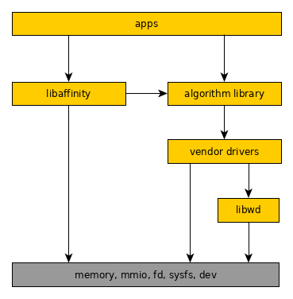
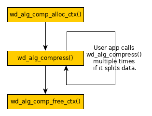
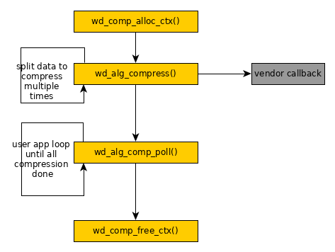

# Warpdrive Architecture Design


| Version | Author | Changes |
| --- | :---- | :---- |
|  0.91   | Haojian Zhuang |1) Remove the content of 3rd party memory  |
|         | Zhou Wang      |   allocation. |
|         |                |2) Remove "ss_va" and "ss_dma" from struct wd_chan.|
|         |                |3) Change to user app polling async interface.  |
|         |                |4) Add examples.  |
|  0.92   |                |1) Reorganize the document. |


## Overview

Warpdrive is an accelerator software architecture to help vendors to use their 
hardware accelerator in user space easily and efficiently. It includes a kernel 
driver named UACCE and a user space library named libwd.

libwd provides a wrapper of basic UACCE user space interfaces, they will be a 
set of helper functions. And libwd offers a set of APIs based on specific 
algorithms to users, who could use this set of APIs to do specific task without 
accessing low level implementations. libwd offers a register interface to let 
hardware vendors to register their own user space driver, which could use above 
help functions to do UACCE related work.



This document focuses on the design of libwd.


## Based Technology

Warpdrive is the architecture to use accelerator in user space. The IOMMU 
creates mapping between IOVA and PA, and software could configure IOVA on 
hardware accelerators in user space directly.

A new technology, SVA (Shared Virtual Address), is the key point of Warpdrive. 
With SVA, IOMMU shares the same page table with MMU that is used by CPU. It 
means the same virtual address could be accepted by IOMMU. It could share 
the memory easily between CPU and devices without any memory copy.

When SVA feature isn't enabled, the CPU address is different from device 
address in Warpdrive. These two scenarioes are called SVA scenario and NOSVA 
scenario in Warpdrive.

In SVA scenario, memory is allocated in user space. In NOSVA scenario, memory 
is allocated by DMA API in kernel space. So memory copy is required. If IOMMU 
is disabled in NOSVA scenario, physical address has to be used. This behavior 
exposes physical address to user space. It'll cause the potential security 
issue. The NOSVA scenario is only used when SVA feature is disabled. It'll be 
removed in the future.

In SVA scenario, memory address is always virtual address whatever it's in 
user application or user (vendor) driver. So sharing memory address is easily 
without any memory copy. In NOSVA scenario, memory address is virtual address 
only in user application. But it's physical address in vendor driver. Virtual 
address could be shared. But it implied memory copy between vendor driver and 
user application. Performance will be hurted in this case.

Since it's designed to allocate memory by DMA API in kernel space, it also 
limited only small piece of memory could be allocated in NOSVA scenario.

Because of the limitations on NOSVA scenario, it'll be removed in the future. 
Warpdrive is designed for SVA scenario.


## UACCE user space API

As the kernel driver of Warpdrive, UACCE offers a set of API between kernel 
and user space.

Since UACCE driver is still under upstreaming process, latest APIs of UACCE 
can be found in <https://lkml.org/lkml/2019/11/22/1728>. UACCE is introduced 
in "uacce.rst" and "sysfs-driver-uacce" of this patchset.

The basic idea of UACCE driver is that a char device will be created for an 
accelerator device, which attributes will be showed in sysfs, like 
"/sys/class/uacce/[device]/[attr_files]". After opening this char device once, 
user will get a channel to access the resource of this accelerator device. 
User can configure above channel by ioctl of this opened fd, and mmap hardware 
resource, like MMIO or channel to user space.


## Warpdrive Helper Functions

### Channel

Channel is the hardware resource that used to communicate between vendor driver 
and hardware accelerator.

In SVA scenario, vendor driver needs to request and release the channel.

***int wd_request_channel(struct wd_chan \*ch);***

***void wd_release_channel(struct wd_chan \*ch);***

When a process wants to communicate with hardware device, it needs to get a 
new channel by *wd_request_channel()*. Since memory address could be either 
allocated or shared in user application, vendor driver needs to bind the 
channel and memory address together.

When a process wants to access the same memory by multiple queues, it could 
rely on the POSIX shared memory API.

In NOSVA scenario, vendor driver also needs to request and release the channel.

***int wd_request_channel(struct wd_chan \*ch);***

***void wd_release_channel(struct wd_chan \*ch);***


### Extra Helper functions in NOSVA

Hardware always requires continuous address. When IOMMU is disabled in NOSVA 
scenario, physical address is required and allocated by DMA API. A memory 
allocation interface is required in NOSVA scenario.

***void \*wd_reserve_mem(struct wd_chan \*ch, size_t size);***

And vendor driver needs to maintain the mapping between virtual address and 
physical (dma) address.

***int wd_get_dma_from_va(struct wd_chan \*ch, void \*va);***

And DMA API can't allocate large size memory.


### mmap

Whatever it's SVA or NOSVA scenario, virtual address always needs to map to 
physical (dma) address.

***void *wd_drv_mmap_qfr(struct wd_chan \*ch, enum uacce_qfrt qfrt, 
size_t size);*** maps qfile region to user space. It's just fill "q->fd" 
and "q->qfrs_offset[qfrt]" into mmap().

***void wd_drv_unmap_qfr(struct wd_chan \*ch, void \*addr, 
enum uacce_qfrt qfrt, size_t size);*** destroys the qfile region by unmap().

qfrt means queue file region type. The details could be found in UACCE kernel 
patch set <https://lkml.org/lkml/2019/11/22/1728>.


## Warpdrive Algorithm Interface

Warpdrive is a framework that supports multiple algorithm interfaces. We'll 
discuss compression algorithm interface in below. And crypto algorithm 
interface will be added later.


### Compression Algorithm Interface

Warpdrive compression algorithm interface is between user application and 
vendor driver.


#### Context

The hardware accelerator is shared in the system. When compression is ongoing, 
warpdrive needs to track the current task. So a context is necessary to record 
key informations. User application needs to request a context before 
compression or decompression.

```
    struct wd_alg_comp {
        char *name;
        int (*init)(...);
        void (*exit)(...);
        int (*deflate)(...);
        int (*inflate)(...);
    };

    struct wd_comp_ctx {
        int                 alg_type;    /* zlib or gzip */
        int                 running_num; /* number of async running task */
        
        struct wd_alg_comp  *hw;
        void                *priv;       /* vendor specific structure */
    };

    struct wd_comp_arg {
        void         *src;
        size_t       src_len;
        void         *dst;
        size_t       dst_len;
        int          flush_type;  /* NO_FLUSH, SYNC_FLUSH, FINISH, INVALID */
    };
```

"src" and "dst" fields of "struct wd_comp_arg" are virtual address. Although 
DMA address is used in NOSVA scenario, user application doesn't need the DMA 
address. So they're are stored in "priv" structure by vendor driver.


***struct wd_comp_ctx \*wd_alg_comp_alloc_ctx(int alg_type)*** requests a 
context.

***void wd_alg_comp_free_ctx(struct wd_comp_ctx \*ctx)*** releases a context.


#### Compression & Decompression

Warpdrive compression algorithm provides the hook interface of hardware 
implementation. It's "hw" field in "struct wd_comp_ctx".

"struct wd_comp_arg" stores the information about source and destination 
buffers. This structure is the input parameter of compression and decompression.

If user application needs the synchronous compression or decompression, 
functions are used in below.

***wd_alg_compress(struct wd_comp_ctx \*ctx, struct wd_comp_arg \*arg, 
void \*tag)***  
***wd_alg_decompress(struct wd_comp_ctx \*ctx, struct wd_comp_arg \*arg, 
void \*tag)*** 

When the above two functions are invoked, user application is blocked until
the hardware operation is done.

If user application wants to handle more tasks in parallel, asynchronous 
operations are used in below.

***wd_alg_comp_poll(struct wd_comp_ctx \*ctx)***  

In asnychronous mode, user application sends multiple compression requests 
to hardware accelerators by one channel. Although data are pipelined to 
hardware accelerator, vendor driver doesn't need to poll the status of 
hardware accelerator. It could save time that cost of polling status on each 
request.

Because *wd_alg_comp_poll()* is a polling function. Suggest user application 
invokes the polling for multiple times. Otherwise, it may miss the event of
hardware accelerator completion.


#### Register Compression Algorithm

When user application executes compression or decompression, the hardware 
implementation that defined in "hw" field of the context is invoked. This
"hw" field is registered by vendor driver.

Warpdrive compression algorithm layer maintains a list of "struct wd_alg_comp". 
When the request of compression or decompression arrives, it compares the 
device name with vendor driver. If they match, related hardware implementation 
is linked to "hw" field of "struct wd_comp_ctx". By this way, vendor driver 
binds to compression algorithm layer with context.


## Example

### Example in user application

Here's an example of compression in user application. User application just 
needs a few APIs to complete synchronous compression.



Synchoronous operation means polling hardware accelerator status of each 
operation. It costs too much CPU resources on polling and causes performance 
down. User application could divide the job into multiple parts. Then it 
could make use of asynchronous mechanism to save time on polling.



By the way, there's also a limitation on asynchronous operation. Let's assume 
there're two frames, A frame and B frame. If the output of hardware accelerator 
is fixed-length, then we can calculate the output address of A and B frame. If 
the length of hardware accelerator output isn't fixed, we have to set the 
temperary address as the output of B frame. Then a memory copy operation is 
required. So we use compression as a demo to explain asynchronous operation. 
It doesn't mean that we recommend to use asynchronous compression.


### Example in vendor driver

Here's an example of implementing vendor driver to support compression.

At first, vendor driver needs to implement the instance of 
"struct wd_alg_comp". The name field of "struct wd_alg_comp" should be "zlib" 
or any compression algorithm name. Then add the instance into the algorithm 
list in Warpdrive helper layer.

When user application invokes "wd_alg_comp_alloc_ctx()", Warpdrive needs to 
find a valid device with the algorithm type, "zlib". Then Warpdrive finds a 
proper vendor driver that supports the device. At this time, those compression 
hooks are bound to hooks in the context, "struct wd_comp_ctx". Then 
"wd_comp_ctx->init()" is called. In this function, vendor driver tries to 
request channel and initialize hardware.

When user application invokes "wd_alg_compress()", "wd_comp_ctx->deflate()" is 
called. It points to the implementation in vendor driver.

When user application invokes "wd_alg_comp_free_ctx()", "wd_comp_ctx->exit()" 
is called. It also points to the implementation in vendor driver. It releases 
channel and free hardware.
